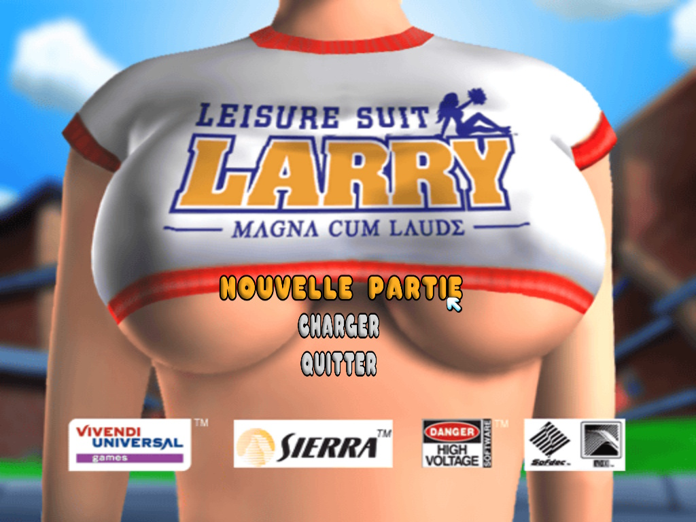
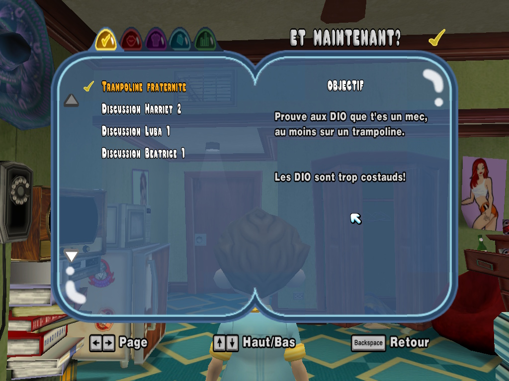

# Leisure Suit Larry: Magna Cum Laude — Multi Language PC

Ce projet est né des nombreuses demandes exprimées sur les forums par des joueurs souhaitant retrouver sur PC le jeu dans la langue qu’ils avaient connue sur PS2.

<p align="center">
  
  
</p>

Moteur Python développé par **Gallyberseker** pour adapter les ressources **PS2** à la version **PC Uncut and Uncensored** de *Leisure Suit Larry: Magna Cum Laude*.

Il prend en charge **EN, FR, DE, ES, IT et RU**, avec des modules et des profils géométriques indépendants pour chaque langue. Un mode de traduction automatique permet également de localiser les textes dans d'autres langues compatibles.

## Fonctionnalités

- **Textes et menus** : localisation des archives JAM, adaptation des polices, rectangles, espacements et interfaces, dont le Livre noir.
- **Audio** : correspondance des voix PC/PS2, traitement ADX/AHX, reconstruction AFS et injection JAM2/ACX, avec restauration de voix PS2 absentes du PC.
- **Cinématiques** : adaptation des pistes audio SFD aux contraintes des ressources PC.
- **Images** : extraction classée par format et dimensions, injection avec adaptation au format et à l'emplacement d'origine, écrans Sierra localisés depuis les ressources Base64 disponibles.
- **Construction** : préparation dans TEMP, création de la version FINI, installation dans le jeu PC et restauration depuis le backup.
- **Diagnostics** : contrôles des sources, textes, menus, audio et vidéos, avec progression et journaux console.

## Traduction automatique — Translate Other

Ce mode traduit **uniquement les textes et interfaces** : menus, objectifs, descriptions, statistiques, messages et Livre noir. **Les voix et l'audio des cinématiques restent dans leur langue disponible.**

Depuis le menu :

1. Choisir **[1] Construire la version localisée complète**.
2. Choisir **[2] Autre langue**, puis **[00] Ajouter nouvelle langue**.
3. Saisir le code proposé pour la langue souhaitée, par exemple `nl`, `pl` ou `pt`, puis confirmer.

La traduction utilise Google via `googletrans`, avec un catalogue par langue. Les traductions enregistrées sont conservées, la progression est sauvegardée après chaque lot et une traduction interrompue peut reprendre en sélectionnant la même langue.

Une connexion Internet est nécessaire. La durée dépend du nombre de textes et du service de traduction ; les résultats peuvent nécessiter une correction manuelle et des ajustements géométriques.

Le japonais, le chinois, le coréen et l'arabe sont actuellement bloqués dans ce parcours en raison des limitations d'affichage des caractères et des polices.

## Installation et lancement

Prévoir **Windows**, **Python 3.12** et les données des versions PC/PS2 utilisées. Le moteur vérifie les dépendances nécessaires, dont Pillow pour les images. Les traitements multimédias utilisent notamment FFmpeg, FFprobe et les outils SFD/CRI adaptés.

GITCLI
```powershell
gh repo clone Gallyberseker/LSL-MCL-PS2-to-PC-MultiLanguage
cd LSL-MCL-PS2-to-PC-MultiLanguage
python Larry_MCL_Language_Multi_PS2_To_PC.py
```

GIT
```
git clone https://github.com/Gallyberseker/LSL-MCL-PS2-to-PC-MultiLanguage.git
cd LSL-MCL-PS2-to-PC-MultiLanguage
python Larry_MCL_Language_Multi_PS2_To_PC.py
```

Dans l'architecture disposant du lanceur séparé, le démarrage peut aussi se faire avec `python LSL_MCL_LANCEUR.py`.

Préparer les sources et vérifier les options dans `LSL_MCL_VARIABLES.py`. Le moteur détecte la version PS2 fournie et propose en **[1] la langue correspondante** dans le menu de sélection des langues. Sélectionner cette proposition pour lancer la construction dans cette langue, ou choisir **[2] Autre langue** pour une traduction automatique des textes. **Conserver une copie du dossier `Data` original et fermer le jeu avant l'installation ou la restauration.**

## Dossiers principaux

| Dossier | Rôle |
| --- | --- |
| `PC_VERSION/Data` | Source PC |
| `PC_VERSION_BACKUP/Data` | Sauvegarde PC de référence |
| `PS2_VERSION/Data` | Ressources PS2 |
| `PC_VERSION_EDIT_TEMPS/Data` | Données en cours de traitement |
| `PC_VERSION_EDIT_FINI/Data` | Version reconstruite à installer |
| `EDITION_IMAGE/All_Image_extract` | Images extraites et classées |
| `EDITION_IMAGE/All_Image_Inject` | Images modifiées à injecter |

Pour injecter une image, conserver le nom permettant sa correspondance avec le manifeste. Le moteur adapte les formats pris en charge et refuse une reconstruction incompatible avec l'emplacement cible.

## Configuration

Les réglages sont centralisés dans **`LSL_MCL_VARIABLES.py`** (`True` = activé, `False` = désactivé).

| Variable | Traitement |
| --- | --- |
| `ACTIVE_TRADUCTION_TEXTE_JAM` | Traduction des textes JAM |
| `ACTIVE_GEOMETRIE` | Rectangles et polices du profil sélectionné |
| `ACTIVE_IMAGE_EXTRACTION` | Extraction et injection des images |
| `ACTIVE_AUDIO_BUILD` | Localisation audio |
| `ACTIVE_VIDEO_ENCODAGE` | Traitement des cinématiques |
| `ACTIVE_TELECHARGEMENT_OUTILS` | Installation automatique des outils et dépendances gérés |
| `ACTIVE_REFERENCES_TECHNIQUES` | Vérification des références techniques |
| `ACTIVE_MENU_USER_AND_DISASBLE_AUTO_BUILD` | Parcours interactif du menu |
| `ACTIVATE_MODE` | Déblocage initial de l'option du mode jeu déja fini|
| `ACTIVATE_NAUGHTY_MODE` | Déblocage initial de l'option Naughty |

Pour inclure les voix et les cinématiques, activer leurs traitements avant la construction. Les deux options bonus sont indépendantes et laissent le joueur choisir leur activation ; les anciennes sauvegardes peuvent conserver leur verrouillage.

## Architecture et réglages

L'architecture sépare le lancement, la vue console, le contrôleur, la construction et les services de traitement des textes, images, voix et vidéos.

Les fichiers **`LSL_MCL_GEO_LANGUAGES_XX.py`** conservent les réglages propres à chaque langue. Les rectangles utilisent `(X1, Y1, X2, Y2)` ; les styles de texte sont traités séparément. Consulter **`GUIDE_GEOMETRIE_LARRY_MCL.txt`** pour les ajustements.

Les ressources PC et PS2 peuvent différer : elles sont adaptées aux contraintes du moteur PC. Vérifier les logs et tester en jeu les langues, les menus et les ressources modifiés. Certains espacements ou débordements peuvent encore demander un réglage.

## Licence et droits des tiers

**Copyright © 2026 Gallyberseker. Tous droits réservés sur ses contributions originales.** Voir le fichier [licence](licence).

L'utilisation personnelle du moteur est gratuite. Sauf droits impératifs prévus par la loi ou les conditions de la plateforme d'hébergement, la modification, la redistribution du code, la publication de versions modifiées et sa réutilisation dans un autre projet nécessitent l'autorisation écrite préalable de l'auteur. La consultation publique du code ne constitue pas une licence générale de réutilisation.

**Leisure Suit Larry**, **Magna Cum Laude**, **Sierra** et les noms, logos, personnages, textes, images, musiques, voix et vidéos associés restent soumis aux droits de leurs titulaires respectifs. Aucune propriété ni autorisation sur ces éléments n'est revendiquée par Gallyberseker. Les outils et bibliothèques tiers conservent leurs propres licences.

Ce projet est indépendant et n'est ni affilié, ni approuvé, ni sponsorisé par Sierra ou les ayants droit du jeu. Les noms et marques sont mentionnés pour identifier le jeu concerné.

## Ressources, distribution et utilisation

Le dépôt a pour objet de fournir le moteur développé pour ce projet, **pas le code source du jeu, ses exécutables, ses images disque ou ses archives propriétaires**. Ces éléments et les versions reconstruites contenant des ressources du jeu ne doivent pas être publiés ou redistribués sans les autorisations requises.

Les fichiers nécessaires doivent provenir de copies obtenues légalement par l'utilisateur. La possession du jeu et l'usage personnel ne constituent pas, à eux seuls, une autorisation générale de traduction, d'adaptation ou de redistribution. Les droits applicables et les conditions des versions utilisées doivent être respectés.

Les images Base64 fournies pour l'écran localisé sont des créations de Gallyberseker sur fond noir. Elles affichent la mention « Tous droits réservés » dans la langue choisie (FR, IT, DE, ES ou RU), afin de conserver la mention des ayants droit dans l'écran localisé. Leur nom sert à identifier la ressource à remplacer ; ces créations ne revendiquent aucun droit sur le jeu. Les éventuels éléments tiers reproduits dans d'autres illustrations ou captures restent soumis aux droits de leurs titulaires.

Le logiciel est fourni en l'état, sans garantie de fonctionnement ou de compatibilité, dans les limites permises par la loi. Conserver une sauvegarde des données originales avant tout traitement. L’auteur décline toute responsabilité dans les limites autorisées par la loi.

Le code du moteur est une création de Gallyberseker. Les droits sur le jeu et les marques citées restent ceux de leurs ayants droit respectifs.

## Auteur

**Gallyberseker** — [GitHub](https://github.com/Gallyberseker/LSL-MCL-PS2-to-PC-MultiLanguage)
